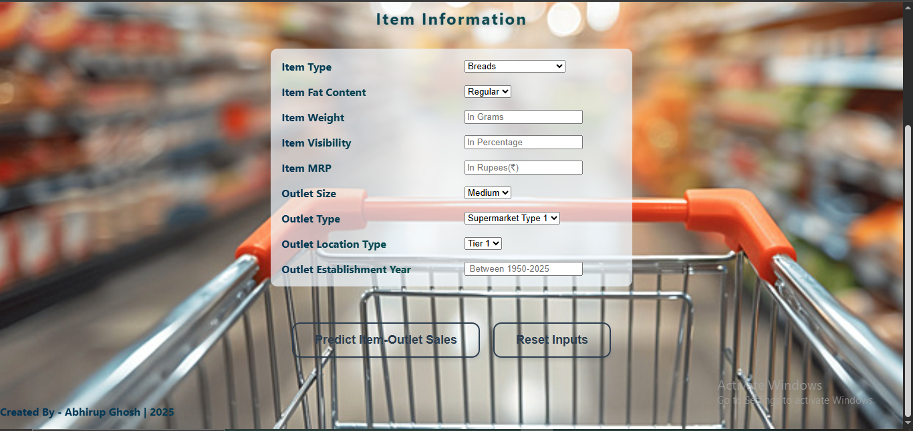

# 🛒 Big Mart Sales Prediction

A machine learning web application that predicts the daily sales of products at Big Mart based on various features such as item details, outlet type, outlet location type, type of city, outlet eastablishment year etc. This project demonstrates end-to-end deployment of a regression model using Flask and a styled HTML/CSS front-end.

---

## 📌 Table of Contents
- [Project Overview](#project-overview)
- [Tech Stack](#tech-stack)
- [Features](#features)
- [Project Structure](#project-structure)
- [How to Run](#how-to-run)
- [Model Details](#model-details)
- [Screenshots](#screenshots)
- [Author](#author)

---

## 🧠 Project Overview

This project uses a machine learning regression model to predict the `Item_Outlet_Sales` based on input features like:
- Item weight, visibility, and MRP
- Item type and fat content
- Outlet size, type, and location
- Outlet establishment year

It provides a user-friendly web interface for input and displays the predicted daily sales.

---

## ⚙️ Tech Stack

**Frontend:**
- HTML5, CSS3
- JavaScript (for form validation)

**Backend:**
- Python
- Flask

**ML Tools:**
- Scikit-learn
- Pandas, NumPy
- Matplotlib, Seaborn, Scipy
- Joblib (for model serialization)

---

## 🚀 Features

- 🧮 Predicts daily sales of items using a trained regression model
- 📋 Clean and validated form inputs
- 🌐 Fully responsive and visually styled frontend
- ⚙️ JavaScript form validation
- 🧠 Machine learning model trained on historical Big Mart data

---

## 🗂️ Project Structure
bigmart-sales-prediction/
│
├── templates/
│ └── index.html, form.html # Frontend HTML form
│
├── randomforest_model.pkl # Trained ML model
│
├── app.py # Flask application
├── README.md # Project documentation

---

## ▶️ How to Run the Project Locally

### 📁 Download the Required Files  
Download and place the following files in the same directory:
- `app.py`
- `randomforest_model.pkl`
- `templates/` folder (containing `index.html`,`form.html`)

### 📦 Install Required Python Libraries  
Open your terminal or command prompt and install the required packages:

```bash
pip install flask pandas numpy scikit-learn
```
### 🚀 Run the Application

After installing the required packages and placing all files in the same folder, start the Flask application by running the following command in your terminal:

```bash
python app.py
```
### 🚀 Open in Browser

Once the server is running, open your web browser and go to the following URL:

[Click here to open the application](http://127.0.0.1:5000)

## 🤖 Model Details

The **Big Mart Sales Prediction** model is built to predict the sales of products in a retail store based on various features such as item characteristics, store details, and more. The model is trained using historical sales data to help predict item-outlet sales.

### Model Type:
- **Model**: Random Forest Regressor
- **Purpose**: To predict the sales of a product at a specific store outlet.

### Features Used:
The model uses the following input features:
1. **Item Type**: The type of product (e.g., breads, dairy foods, frozen foods, etc.)
2. **Item Fat Content**: The fat content of the product (regular, low fat)
3. **Item Weight**: The weight of the product (in grams)
4. **Item Visibility**: The visibility of the product in the store (in percentage)
5. **Item MRP**: The Maximum Retail Price (MRP) of the product (in rupees)
6. **Outlet Size**: The size of the outlet (e.g., small, medium, high)
7. **Outlet Type**: Type of outlet (supermarket type 1, type 2, etc.)
8. **Outlet Location Type**: Type of outlet location (tier 1, tier 2, tier 3)
9. **Outlet Age**: The age of the outlet (calculated as the difference between the current year and the outlet establishment year)

### Model Training:
- **Dataset**: The model was trained using the Big Mart sales dataset, which contains historical data of product sales from multiple outlets.
- **Training Process**: The model was trained using the Random Forest Regressor algorithm, a popular ensemble learning technique for regression tasks. The training process involved splitting the data into training and testing sets, followed by model evaluation using **R²** score.

### Model Performance:
- **R² (R-squared)**: The R² value is a measure of how well the model explains the variance in the data. Higher R² values indicate better model performance.

### Usage:
- **Predictions**: Once the model is trained, it can predict the sales of any given item at any outlet based on the input features provided by the user.
- The model is saved in a file named `randomforest_model.pkl` for use in the application.

### Model Files:
- **Model File**: [randomforest_model.pkl] - The trained model is saved as a `.pkl` file, which is loaded in the application for making predictions.

## 📸 Screenshots

### 1. Home Page

Here is a screenshot of the home page of the application where users can input product details:


### 2. Prediction Result

Here is how the form page looks like where you can submit the form by filling necessary details:



## 👨‍💻 About the Author

**Abhirup Ghosh**  
Aspiring AI/ML Developer | Python & Data Science Enthusiast  
Passionate about building intelligent systems and solving real-world problems using Machine Learning.

Feel free to connect with me:

- [LinkedIn](https://www.linkedin.com/in/abhirupghosh79277716b/)
- [GitHub](https://github.com/abhifg)
- 📧 Email: abhirup9799@gmail.com


